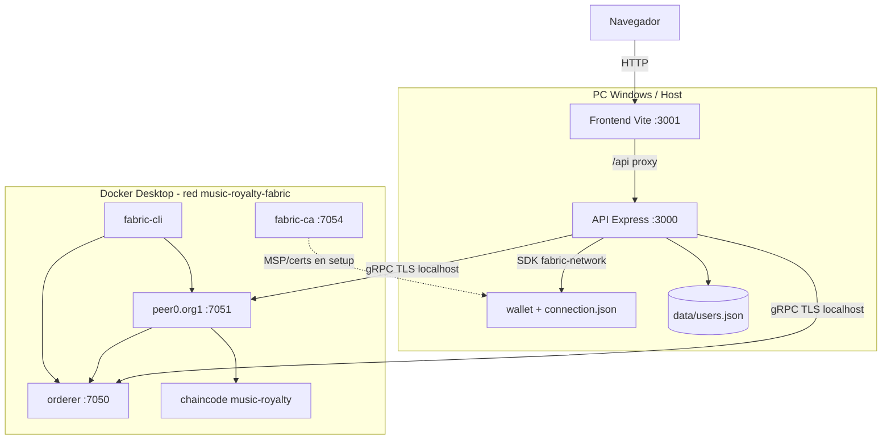
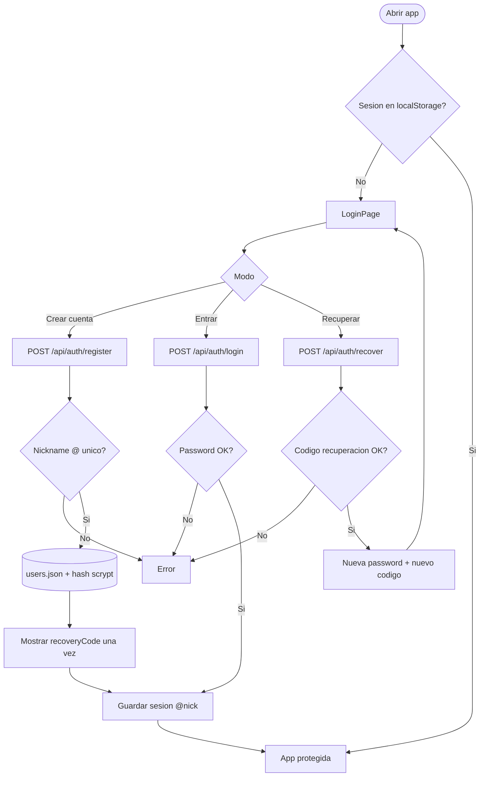
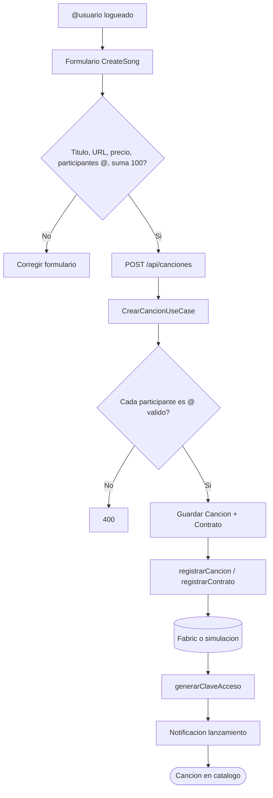
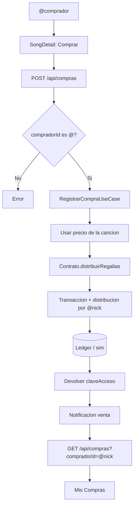
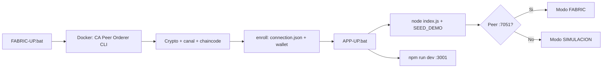

# Music Royalty — Sistema de Regalías Musicales con Hyperledger Fabric

Plataforma académica / demo para **registrar canciones**, definir **contratos de regalías** con identidades `@usuario`, **vender** en catálogo y **distribuir pagos** de forma trazable sobre **Hyperledger Fabric** (o simulación local).

| Capa | Tecnología |
|------|------------|
| UI | React 18 + Vite + react-i18next (ES/EN) |
| API | Node.js + Express (DDD / casos de uso) |
| Identidad app | Nickname `@usuario` + contraseña (`data/users.json`) |
| Blockchain | Hyperledger Fabric **2.5.16** + Fabric CA **1.5.21** |
| Chaincode | Node (`music-royalty`) en canal `mychannel` |
| Contenedores | Docker Desktop + Compose |

---

## Tabla de contenidos

1. [Qué hace el negocio](#1-qué-hace-el-negocio)
2. [Arquitectura y despliegue](#2-arquitectura-y-despliegue)
3. [Diagramas de flujo](#3-diagramas-de-flujo)
4. [Requisitos](#4-requisitos)
5. [Instalación y arranque (Windows)](#5-instalación-y-arranque-windows)
6. [Uso de la aplicación](#6-uso-de-la-aplicación)
7. [API REST](#7-api-rest)
8. [Estructura del repositorio](#8-estructura-del-repositorio)
9. [Scripts útiles](#9-scripts-útiles)
10. [Solución de problemas](#10-solución-de-problemas)
11. [Mac / Linux](#11-mac--linux)

---

## 1. Qué hace el negocio

1. Un usuario se **registra / inicia sesión** con un nickname único tipo `@artista1`.
2. Puede **publicar una canción** con precio y participantes de regalías (solo nicknames `@…`, porcentajes = 100%).
3. Otros usuarios **compran** desde el catálogo; la compra genera una **transacción** y **reparte el monto**.
4. El comprador obtiene una **clave de acceso** para descargar.
5. **Analytics** y **notificaciones** reflejan lanzamientos y ventas.

Al arrancar la API se siembra un **catálogo demo** con usuarios ficticios de la misma red (password `demo1234`):  
`@luna_beats`, `@marco_prod`, `@sofia_lyrics`, `@dj_nova`, `@echo_label`, `@riley_mix`.

---

## 2. Arquitectura y despliegue

### Diagrama de despliegue



### Componentes

| Pieza | Rol |
|-------|-----|
| **Frontend** | Login, catálogo, crear canción, compra, mis compras, analytics, notificaciones |
| **API** | Auth, canciones, compras, claves, analytics, seed demo |
| **Fabric** | Ledger inmutable: canciones, contratos, transacciones |
| **Modo simulación** | Si no hay Fabric (`ALLOW_SIMULATION=true`), memoria local equivalente |

### Puertos

| Servicio | Puerto |
|----------|--------|
| Frontend | `3001` |
| API | `3000` |
| Peer | `7051` |
| Orderer | `7050` |
| Fabric CA | `7054` |

---

## 3. Diagramas de flujo

### 3.1 Registro / Login / Recuperación



### 3.2 Publicar canción + contrato de regalías



### 3.3 Compra y distribución de regalías



### 3.4 Arranque del sistema (Windows)



---

## 4. Requisitos

| Software | Para qué |
|----------|----------|
| **Windows 10/11** (recomendado) | Scripts `.bat` oficiales |
| **Node.js 18+** | API, frontend, enroll wallet |
| **Docker Desktop** | Red Fabric real (icono en **verde**) |
| **Git** (opcional) | Clonar repo / scripts bash |

Activa **File sharing** de la unidad del proyecto en Docker Desktop (p. ej. `D:`).

---

## 5. Instalación y arranque (Windows)

### 5.1 Obtener el código

```bat
git clone https://github.com/Mianjoy/Blockchain-Musical-.git
cd Blockchain-Musical-
```

O descarga ZIP → **Code → Download ZIP** y extráelo.

### 5.2 Dependencias (primera vez)

Doble clic en:

```text
install-dependencies.bat
```

Instala/verifica Node, (opcional) Git y Docker. También:

```text
npm install
cd frontend && npm install
```

### 5.3 Arranque recomendado (Fabric + App)

```text
1) Abre Docker Desktop → espera icono verde
2) FABRIC-UP.bat     → red blockchain (puede tardar varios minutos la 1ª vez)
3) APP-UP.bat        → API + UI (si falta Fabric, cae a simulación)
```

| Script | Función |
|--------|---------|
| `FABRIC-UP.bat` | Solo Fabric 2.5.16 (contenedores + canal + chaincode + wallet) |
| `FABRIC-DOWN.bat` | Solo apaga Fabric |
| `APP-UP.bat` | API + frontend |
| `ARRANCAR-DEMO.bat` | Solo simulación (sin Docker) |
| `ARRANCAR.bat` | Menú de opciones: Fabric+App, DEMO, solo Fabric o solo App. Args: `/demo`, `/fabric`, `/app` |
| `CERRAR-TODO.bat` / `DETENER.bat` | Cierra API, UI y Fabric |
| `crear-acceso-directo.bat` | Icono en el Escritorio apuntando a `ARRANCAR.bat` |
| `REPARAR-FABRIC.bat` | Limpia y regenera la red |
| `FIX-DOCKER-API.bat` | Mitiga error API Docker 1.25 al instalar chaincode |
| `DIAGNOSTICO.bat` | Prueba Docker y montaje de volúmenes |

### 5.4 URLs

| Qué | URL |
|-----|-----|
| Interfaz | http://localhost:3001 |
| API | http://localhost:3000/api |
| Health | http://localhost:3000/health |
| Info catálogo demo | http://localhost:3000/api/demo/info |

Comprobar Fabric:

```text
http://localhost:3000/health
→ fabric.connected: true   (o simulation: true)
```

### 5.5 Compose

```text
docker-compose.fabric.yml         # peer, orderer, CA, CLI (red music-royalty-fabric)
network/docker-compose-net.yaml   # compose usado por fabric-up.bat
docker-compose.app.yml            # API opcional en la misma red Docker
```

---

## 6. Uso de la aplicación

1. **Crear cuenta** (`@minombre` + contraseña ≥ 4) o login.
2. **Canciones**: catálogo demo + filtros; ver banner de usuarios ficticios.
3. **Crear canción**: participantes solo con `@nickname`; % = 100.
4. **Comprar**: la compra usa tu `@`; regalías a los `@` del contrato.
5. **Mis compras**: listado real de tu nickname (sin datos genéricos).
6. **Analytics / Notificaciones**: ventas y lanzamientos (i18n ES/EN).

---

## 7. API REST

| Método | Ruta | Descripción |
|--------|------|-------------|
| `POST` | `/api/auth/register` | Alta `@nick` + password → devuelve `recoveryCode` (una vez) |
| `POST` | `/api/auth/login` | Login |
| `POST` | `/api/auth/recover` | Reset clave con nick + código de recuperación |
| `GET` | `/api/auth/check/:nickname` | Disponibilidad de nick |
| `GET` | `/api/canciones` | Listar |
| `GET` | `/api/canciones/:id` | Detalle |
| `POST` | `/api/canciones` | Crear (requiere `usuarioId` `@…`) |
| `POST` | `/api/compras` | Comprar |
| `GET` | `/api/compras?compradorId=@nick` | Compras del usuario |
| `GET` | `/api/descargar/:cancionId` | Clave de acceso |
| `GET` | `/api/analytics/regalias` | Reportes |
| `GET` | `/api/notificaciones` | Notificaciones |
| `GET` | `/api/demo/info` | Usuarios demo |
| `GET` | `/api/logs/fabric-workflow` | Últimas líneas del registro de flujos |
| `POST` | `/api/admin/seed-demo` | Re-sembrar catálogo demo |
| `GET` | `/health` | Estado API / Fabric |

### Registro de flujos Fabric (demo / proyector)

Cada operación relevante escribe en:

```text
logs/fabric-workflow.log
```

Bloques por flujo, por ejemplo:

- `PUBLICAR_CANCION` — validación → ledger canción → contrato → clave
- `COMPRA_Y_REGALIAS` — precio → distribución por `@nick` → transacción
- `SEED_CATALOGO_DEMO` — usuarios y canciones demo
- Eventos `CONEXION` / `LEDGER` / `RED_FABRIC` (arranque de red)

Ver en vivo:

```text
http://localhost:3000/api/logs/fabric-workflow?lines=300
```

O abrir el archivo en un editor mientras haces compras/publicaciones.

Variables útiles:

| Variable | Efecto |
|----------|--------|
| `ALLOW_SIMULATION=true` | Permite API sin Fabric |
| `SEED_DEMO=false` | No genera catálogo demo |
| `SEED_DEMO_FORCE=true` | Intenta completar demos faltantes |
| `CONNECTION_PROFILE` | Ruta a `connection.json` |
| `FABRIC_AS_LOCALHOST` | `true` si la API corre en el host Windows |

---

## 8. Estructura del repositorio

```text
Blockchain-Musical-/
├── api/                    # Express + DI
├── application/use-cases/  # Crear canción, compra, claves, listar compras
├── domain/                 # Entidades, nickname utils
├── infrastructure/
│   ├── auth/               # UserAuthStore
│   ├── blockchain/         # HyperledgerFabricService
│   ├── repositories/
│   ├── seed/               # Catálogo demo
│   └── services/           # Analytics, notificaciones
├── chaincode/music-royalty/
├── frontend/               # React + Vite (app oficial)
├── network/                # Compose, configtx, scripts Fabric
├── scripts/windows/        # fabric-up, start-app, docker helpers
├── data/                   # users.json (local, gitignored)
├── wallet/                 # Identidad SDK (gitignored)
├── FABRIC-UP.bat / APP-UP.bat / ...
└── README.md
```

No versionar: `connection.json`, `wallet/*`, crypto MSP, `data/users.json`, `*.log`.

---

## 9. Scripts útiles

```bat
REPARAR-FABRIC.bat
FIX-DOCKER-API.bat
DIAGNOSTICO.bat
```

Manual Fabric (CMD):

```bat
scripts\windows\fabric-up.bat up
scripts\windows\fabric-up.bat down
scripts\windows\fabric-up.bat clean
node scripts\enrollAppUser.js
```

---

## 10. Solución de problemas

| Problema | Qué hacer |
|----------|-----------|
| `fabric-tools:3.x not found` | El proyecto usa **2.5.16** (tools 3.x ya no se publica) |
| Docker no en PATH / no responde | Abrir Docker Desktop en verde; `FABRIC-UP.bat` espera el CLI |
| Error volúmenes / 125 | File sharing de la unidad del repo en Docker Desktop |
| `client version 1.25 is too old` | `FIX-DOCKER-API.bat` → Apply & Restart → `REPARAR-FABRIC.bat` |
| `discovery error: access denied` / `unknown authority` | Crypto/volumen desalineados: `REPARAR-FABRIC.bat` (borra volúmenes Docker + regenera MSP). Luego `APP-UP.bat` |
| Canal sin `height` ilegible | Ya hay auto-reset; si falla: `REPARAR-FABRIC.bat` |
| API en simulación con Fabric “arriba” | Ejecuta `REPARAR-FABRIC.bat` y arranca con `ARRANCAR.bat` (modo Fabric estricto) |
| API busca `connection.json` mal | Debe estar en la **raíz del repo** (generado por `FABRIC-UP`) |
| Mis compras genéricas | Ya se listan por `@` real; reinicia API tras actualizar |
| Catálogo vacío | Reinicia API (`SEED_DEMO=true`) o `POST /api/admin/seed-demo` |

---

## 11. Mac / Linux

```bash
chmod +x start-system.sh stop-system.sh network/scripts/*.sh
./start-system.sh
# detener:
./stop-system.sh
# o solo red:
bash network/scripts/network.sh up
```

---

## Licencia

MIT — proyecto de demostración / fines académicos.
